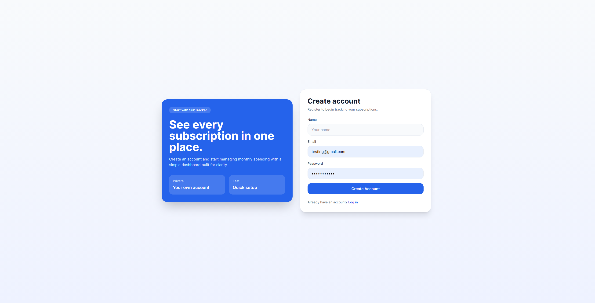
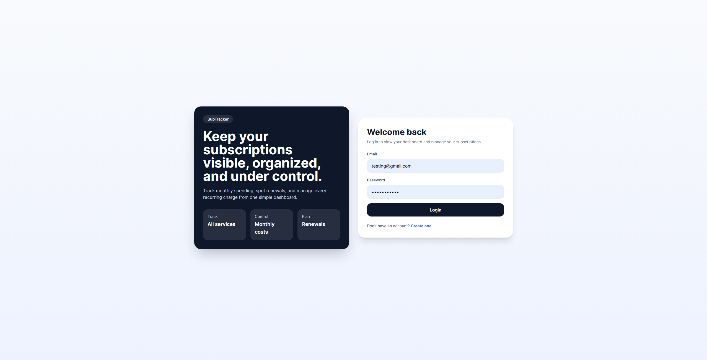
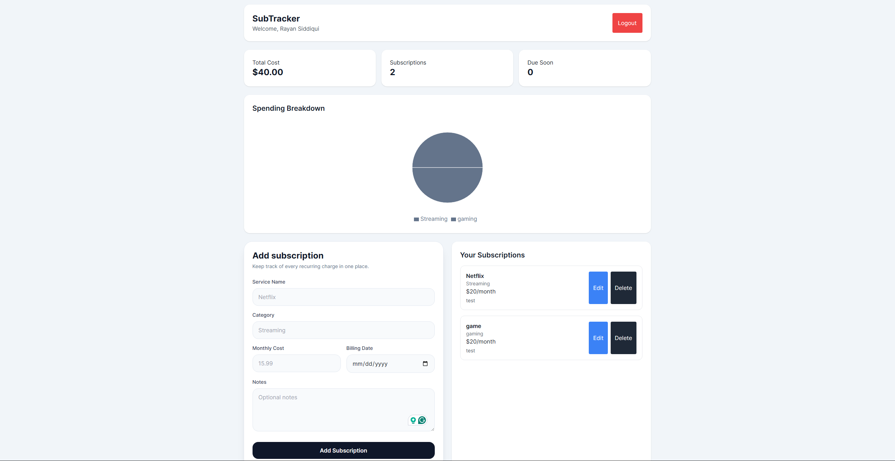

# SubTracker

## 📌 Overview
SubTracker is a full-stack web application that helps users manage and track their subscription services in one centralized dashboard. It allows users to monitor monthly costs, track billing dates, and identify unnecessary subscriptions.

---

## 🚀 Features

- User Authentication (Register/Login with JWT)
- Add, Edit, and Delete Subscriptions
- Monthly Cost Calculation
- Upcoming Billing Alerts (within 7 days)
- Category-based Spending Chart
- Notes/Additional Info for each subscription
- Responsive UI (works on different screen sizes)

---

## 🛠️ Tech Stack

Frontend:
- React (Vite)
- Tailwind CSS
- Recharts

Backend:
- Node.js
- Express.js
- MongoDB (Atlas)
- JWT Authentication

Deployment:
- Frontend: Vercel
- Backend: Render

---

## 📸 Screenshots
### Register Page


### Login Page


### Dashboard



## 🌐 Live Demo
Demo Video: https://youtu.be/3UDHa785GcE

Frontend:
👉 https://subtracker-gilt.vercel.app/

Backend:
👉 https://subtracker-api-kpe2.onrender.com/api/test

---

## ⚙️ Installation & Setup

### Clone repo
```bash
git clone https://github.com/Rayan-Siddiqui/Subtracker.git


cd Subtracker
